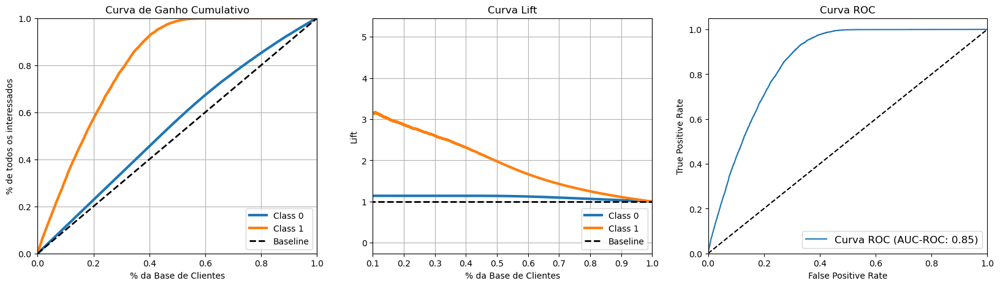

# Ranqueamento de interessados em seguro de carro

A empresa e contexto a seguir são completamente fictícios.

---
# 1.0. Descrição

A empresa de seguro de saúde Insurance All está considerando a possibilidade de expandir seus serviços para incluir um 
novo produto: seguro de automóveis. 
O time de produtos deseja avaliar a viabilidade desse novo produto, identificando o potencial de receita e o público-alvo adequado. 
Para isso, realizaram uma pesquisa com a base de clientes existente para verificar o interesse na compra do seguro de 
automóveis. No entanto, há também novos clientes que não participaram da pesquisa, e o time precisa decidir quais deles devem ser 
contatados para oferecer o seguro de carro.  
Eles têm um limite de 20.000 pessoas que podem ser contatadas durante uma campanha telefônica.  
O objetivo é fornecer ao time de produtos uma lista de potenciais clientes interessados nesse novo produto.

# 2.0. Questões do negócio

1. Principais Insights sobre os atributos mais relevantes de clientes interessados em adquirir um seguro de automóvel.
2. Qual a porcentagem de clientes interessados em adquirir um seguro de automóvel o time de vendas conseguirá contatar fazendo 20.000 ligações?
3. E se a capacidade do time de vendas aumentar para 40.000 ligações, qual a porcentagem de clientes interessados em adquirir um seguro de automóvel o time de vendas conseguirá contatar?
4. Quantas ligações o time de vendas precisa fazer para contatar 80% dos clientes interessados em adquirir um seguro de automóvel?

# 3.0. Planejamento da Solução

## 3.1. Produto Final

Entrega de uma planilha que realize o ranqueamento de uma lista de clientes com maior interesse no seguro de automóveis através do 
Google Sheets. 

## 3.2. Ferramentas

* Python 3.8.16
*	Jupyter Notebook
* VS Code

## 3.3. Processo de Solução

Passo 01 - Descrição dos Dados: Estudo inicial dos dados disponíveis para realização do projeto; 
Passo 02 - Feature Engineering: Transformação dos dados para uma melhor análise; 
Passo 03 - Filtragem das variáveis: Remoção de variáveis ou linhas que não serão necessárias; 
Passo 04 - Análise Exploratória dos Dados (EDA): Verificação do comportamento das variáveis e correlação entre elas, assim como a criação de hipóteses ; 
Passo 05 - Preparação dos Dados: Realização de encodes para utilização de modelos de Machine Learning; 
Passo 06 - Seleção de Features: Seleção das principais features do banco de dados para realização das predições; 
Passo 07 - Modelagem do Machine Learning: Teste de diversos algoritmos de Machine Learning; 
Passo 08 - Ajuste Fino dos Hiperparâmetros: Escolha dos hiperparâmetros do melhor modelo de Machine Learning, com a finalidade de aumentar ainda mais a performance do modelo; 
Passo 09 - Respondendo as Perguntas de Negócio: Solução das questões de negócio; 
Passo 10 - Implementando Modelo em Produção: Implemento do modelo de Machine Learning através do Google Sheets.
	
# 4.0. Modelos de ML utilizados

* KNN;
* Logistic Regression;
* Random Forest Regressor;
* Extra Trees;
* XGBoost;
* Decision Tree.

# 7.0. Performance dos modelos

Performance dos modelos sem cross-validation:
<table>
  <tr>
    <th>Modelo</th>
    <th>Precision at 20000</th>
    <th>Recall at 20000</th>
    <th>F1-Score at 20000</th>
  </tr>
  <tr>
    <td>KNN</td>
    <td>0.261</td>
    <td>0.876</td>
    <td>0.402</td>
  </tr>  
  <tr>
    <td>Logistic Regression</td>
    <td>0.264</td>
    <td>0.887</td>
    <td>0.407</td>
  </tr> 
  <tr>
    <td>Random Forest Classifier</td>
    <td>0.269</td>
    <td>0.904</td>
    <td>0.415</td>
  </tr> 
  <tr>
    <td>Extra Trees</td>
    <td>0.267</td>
    <td>0.897</td>
    <td>0.412</td>
  </tr> 
  <tr>
    <td>XGBoost</td>
    <td>0.278</td>
    <td>0.933</td>
    <td>0.428</td>
  </tr> 
  <tr>
    <td>Decision Tree</td>
    <td>0.160</td>
    <td>0.538</td>
    <td>0.247</td>
  </tr>   
</table>

Performance dos modelos com cross-validation:
<table>
  <tr>
    <th>Modelo</th>
    <th>Precision_CV at 20000</th>
    <th>Recall_CV at 20000</th>
    <th>F1-Score_CV at 20000</th>
  </tr>
  <tr>
    <td>KNN</td>
    <td>0.279</td>
    <td>0.703</td>
    <td>0.399</td>
  </tr>  
  <tr>
    <td>Logistic Regression</td>
    <td>0.279</td>
    <td>0.702</td>
    <td>0.399</td>
  </tr> 
  <tr>
    <td>Random Forest Classifier</td>
    <td>0.296</td>
    <td>0.746</td>
    <td>0.424</td>
  </tr> 
  <tr>
    <td>Extra Trees</td>
    <td>0.0291</td>
    <td>0.734</td>
    <td>0.0417</td>
  </tr> 
  <tr>
    <td>XGBoost</td>
    <td>0.315</td>
    <td>0.794</td>
    <td>0.451</td>
  </tr> 
  <tr>
    <td>Decision Tree</td>
    <td>0.178</td>
    <td>0.448</td>
    <td>0.255</td>
  </tr>   
</table>

Os modelos Random Forest e XGBoost apresentaram uma boa performance de aprendizagem, ambos utilizam árvores de decisão em sua 
implementação. 
Neste primeiro ciclo CRISP iremos adotar o Random Forest Classifier como modelo de classificação para verificarmos sua capacidade de 
generalização para dados nunca visto. Mas antes, será necessário realizar o ajuste fino dos hiperparâmetros. 
Através da classe RandomizedSearchCV da biblioteca Scikit-learn, a qual testa o modelo com diferentes valores para cada 
hiperparâmetro com a intenção de encontrar a melhor combinação, foram feitos os ajustes dos hiperparâmetros do 
algoritmo Random Forest Classifier.

Hiperparâmetros utilizados:
<table>
  <tr>
    <th>Hiperparâmetros</th>
    <th>Valores utilizados</th>
  </tr>
  <tr>
    <td>n_estimators</td>
    <td>100</td>
  </tr>
  <tr>
    <td>min_samples_split</td>
    <td>2</td>
  </tr>
  <tr>
    <td>min_samples_leaf</td>
    <td>2</td>
  </tr>
  <tr>
    <td>max_features</td>
    <td>auto</td>
  </tr>
  <tr>
    <td>max_depth</td>
    <td>10</td>
  </tr>
  <tr>
    <td>bootstrap</td>    
    <td>False</td>
  </tr>  
</table>

<i>Obs.: Os valores dos hiperparâmetros foram definidos levando em conta, também, o peso de armazenado do modelo final. 
Devido a limitação de armazenamento das ferramentas necessárias para realizar o deploy do modelo em produção.</i>

# 8.0. Respondendo as questões de negócio

**1. Principais Insights sobre os atributos mais relevantes de clientes interessados em adquirir um seguro de automóvel.**

    H1. Pessoas com mais de 30 anos têm mais interesse no seguro de carro.
    Verdadeira. Vemos um aumento na quantidade de interessados e uma maior porcentagem de interessados por idade.

    H2. Pessoas que já têm seguro têm menos interesse no seguro oferecido.
    Verdadeira. Quase nenhuma pessoa com seguro tem interesse no seguro oferecido.
    
    H3. Pessoas que já tiveram o carro danificado têm mais interesse no seguro.
    Verdadeira. A grande maioria dos interessados teve o carro danificado.
    
    H4. Pessoas com carros mais novos têm mais interesse no seguro.
    Falsa. Ao contrário, observa-se que quão mais velho o veículo, maior a taxa de interessados.

**2. Qual a porcentagem de clientes interessados em adquirir um seguro de automóvel, o time de vendas conseguirá contatar fazendo 20.000 ligações?**

    Das 20.000 ligações, 30.2% dos clientes estarão interessados.
    Com 20.000 ligações o time de vendas conseguirá contatar 86.3% do total de interessados.

**3. E se a capacidade do time de vendas aumentar para 40.000 ligações, qual a porcentagem de clientes interessados em adquirir um seguro de automóvel o time de vendas conseguirá contatar?**

    Das 40.000 ligações, 17.5% dos clientes estarão interessados.
    Com 40.000 ligações o time de vendas conseguirá contatar 99.9% do total de interessados.

**4. Quantas ligações o time de vendas precisa fazer para contatar 80% dos clientes interessados em adquirir um seguro de automóvel?**
    
    Para contatar 80% dos clientes interessados, o time de vendas precisará realizar 17877 ligações.

# 9.0. Conclusão

Com o ranqueamento de interessados fornecido pelo modelo de Machine Learning a equipe de vendas conseguirá fazer contato com quase 
100% dos interessados ao ligar para apenas 50% do total de clientes da base de dados. 
Conforme observamos no gráfico de Ganho Cumulativo abaixo. 
É possível obervar pelo gráfico da Curva de Lift que ao ligar para 50% da base de clientes, estaremos sendo 2 vezes mais eficientes 
do que se fossem feitas ligações aleatórias. E também, com um AUC-ROC de 0.85, concluímos que o modelo está com uma 
boa performance em distinguir as duas classes.

Performance de generalização do modelo:
<table>
  <tr>
    <th>Modelo</th>
    <th>Precision at 20000</th>
    <th>Recall at 20000</th>
    <th>F1-Score at 20000</th>
  </tr>
  <tr>
    <td>Random Forest Classifier</td>
    <td>0.302</td>
    <td>0.863</td>
    <td>0.448</td>
  </tr>
</table>

Com isso, podemos concluir que o objetivo do projeto foi alcançado, permitindo aumentar a eficácia das 20.000 ligações que o time de 
vendas poderá realizar. 
Foi disponibilizado o acesso ao modelo de ranqueamento dos interessados através do Google Sheets, conforme mostrado no vídeo: 

# 10.0. Próximos passos

Testar o modelo com as demais colunas que não foram selecionadas para tentar melhorar a performance. 
Testar outros encodes e transformações na preparação dos dados para tentar melhorar a performance do algoritmo. 
Verificar se o balanceamento da classe melhoraria a performance do modelo.

----
Fontes: 
Imagem do Pexels (<a href="https://www.pexels.com/pt-br/foto/carro-modelo-em-escala-verde-no-pavimento-marrom-35967/" target="_blank">link</a>) 
Dados do Kaggle (<a href="https://www.kaggle.com/anmolkumar/health-insurance-cross-sell-prediction" target="_blank">link</a>).
